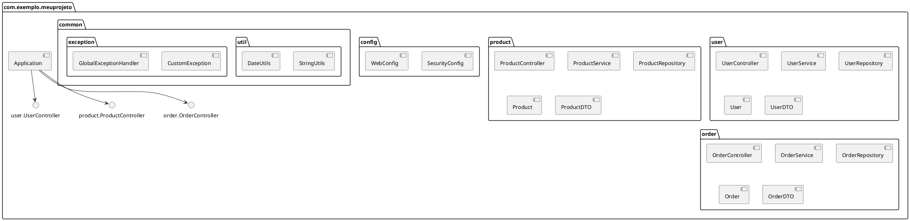

Documentar a estrutura de pacotes de um projeto Java é fundamental para **facilitar a compreensão**, **manutenção** e **colaboração** entre os membros da equipe. Uma boa documentação serve como um guia para novos desenvolvedores, auxilia na navegação pelo código e garante que todos sigam as mesmas convenções e padrões.

A seguir, apresento um exemplo de como você pode documentar a estrutura de pacotes do seu projeto Java. Este exemplo utiliza uma abordagem **Organização por Funcionalidade (Feature-Based Packaging)**, mas você pode adaptá-lo conforme a estrutura escolhida (como DDD, Modular Packaging, etc.).

## Exemplo de Documentação da Estrutura de Pacotes

### 1. **Introdução**

#### 1.1. **Objetivo**
Este documento descreve a estrutura de pacotes adotada para o projeto **[Nome do Projeto]**. O objetivo é fornecer uma visão clara e detalhada de como as classes e módulos estão organizados, facilitando a navegação e manutenção do código.

#### 1.2. **Escopo**
A documentação abrange a organização geral dos pacotes, a descrição de cada pacote principal e as diretrizes para adicionar novos componentes ao projeto.

### 2. **Visão Geral da Estrutura de Pacotes**

A estrutura de pacotes segue a abordagem de **Organização por Funcionalidade**, agrupando classes relacionadas a uma mesma funcionalidade em pacotes dedicados. Além disso, há pacotes comuns para utilitários e configurações gerais do sistema.

#### 2.1. **Diagrama de Pacotes**


*Nota: Você pode gerar diagramas de pacotes utilizando ferramentas como [PlantUML](https://plantuml.com/pt/package-diagram) ou [Visual Paradigm](https://www.visual-paradigm.com/).*

#### 2.2. **Estrutura de Pacotes**

```
com.exemplo.meuprojeto
│
├── user
│   ├── controller
│   │   └── UserController.java
│   ├── service
│   │   └── UserService.java
│   ├── repository
│   │   └── UserRepository.java
│   ├── model
│   │   └── User.java
│   └── dto
│       └── UserDTO.java
│
├── product
│   ├── controller
│   │   └── ProductController.java
│   ├── service
│   │   └── ProductService.java
│   ├── repository
│   │   └── ProductRepository.java
│   ├── model
│   │   └── Product.java
│   └── dto
│       └── ProductDTO.java
│
├── order
│   ├── controller
│   │   └── OrderController.java
│   ├── service
│   │   └── OrderService.java
│   ├── repository
│   │   └── OrderRepository.java
│   ├── model
│   │   └── Order.java
│   └── dto
│       └── OrderDTO.java
│
├── config
│   ├── SecurityConfig.java
│   └── WebConfig.java
│
├── common
│   ├── util
│   │   ├── StringUtils.java
│   │   └── DateUtils.java
│   └── exception
│       ├── CustomException.java
│       └── GlobalExceptionHandler.java
│
└── Application.java
```

### 3. **Descrição Detalhada dos Pacotes**

#### 3.1. **Pacote `user`**

Responsável por todas as funcionalidades relacionadas aos usuários do sistema.

- **`controller`**: Contém as classes responsáveis por lidar com as requisições HTTP relacionadas aos usuários.
  - `UserController.java`: Define os endpoints para operações de usuário (e.g., criação, atualização, recuperação).

- **`service`**: Contém a lógica de negócio relacionada aos usuários.
  - `UserService.java`: Implementa métodos para gerenciar usuários, como criação, validação e recuperação.

- **`repository`**: Define as interfaces de acesso a dados para usuários.
  - `UserRepository.java`: Interface que estende `JpaRepository` para operações CRUD no banco de dados.

- **`model`**: Contém as entidades de domínio relacionadas aos usuários.
  - `User.java`: Define a entidade `User` com seus atributos e relacionamentos.

- **`dto`**: Contém os Data Transfer Objects usados para transferir dados entre as camadas.
  - `UserDTO.java`: Classe usada para transferir dados de e para operações de usuário.

#### 3.2. **Pacote `product`**

Responsável por todas as funcionalidades relacionadas aos produtos do sistema.

- **`controller`**
  - `ProductController.java`

- **`service`**
  - `ProductService.java`

- **`repository`**
  - `ProductRepository.java`

- **`model`**
  - `Product.java`

- **`dto`**
  - `ProductDTO.java`

*(A descrição para `product` é similar à do pacote `user`.)*

#### 3.3. **Pacote `order`**

Responsável por todas as funcionalidades relacionadas aos pedidos do sistema.

- **`controller`**
  - `OrderController.java`

- **`service`**
  - `OrderService.java`

- **`repository`**
  - `OrderRepository.java`

- **`model`**
  - `Order.java`

- **`dto`**
  - `OrderDTO.java`

*(A descrição para `order` é similar às anteriores.)*

#### 3.4. **Pacote `config`**

Contém as classes de configuração do aplicativo.

- `SecurityConfig.java`: Configurações de segurança, como autenticação e autorização.
- `WebConfig.java`: Configurações gerais da web, como CORS, conversores de mensagens, etc.

#### 3.5. **Pacote `common`**

Contém classes e componentes que são compartilhados entre diferentes funcionalidades.

- **`util`**: Classes utilitárias com métodos estáticos para operações comuns.
  - `StringUtils.java`: Métodos utilitários para manipulação de strings.
  - `DateUtils.java`: Métodos utilitários para manipulação de datas.

- **`exception`**: Classes relacionadas ao tratamento de exceções.
  - `CustomException.java`: Exceções personalizadas do sistema.
  - `GlobalExceptionHandler.java`: Manipulador global de exceções para capturar e responder a erros de forma consistente.

#### 3.6. **Classe Principal**

- `Application.java`: Classe principal que inicia a aplicação Spring Boot.

### 4. **Racional para a Escolha da Estrutura**

Optamos pela **Organização por Funcionalidade** devido aos seguintes motivos:

1. **Alta Coesão**: Agrupamos todas as classes relacionadas a uma mesma funcionalidade em pacotes dedicados, facilitando a localização e manutenção.
2. **Escalabilidade**: Facilita a adição de novas funcionalidades sem impactar a estrutura existente.
3. **Facilidade de Entendimento**: Novos desenvolvedores podem entender rapidamente a estrutura do projeto, identificando onde cada componente está localizado.
4. **Isolamento de Responsabilidades**: Cada pacote de funcionalidade encapsula suas próprias camadas (controller, service, repository, etc.), promovendo baixo acoplamento e alta coesão.

### 5. **Diretrizes para Adicionar Novos Componentes**

#### 5.1. **Adicionar uma Nova Funcionalidade**

1. **Criar o Pacote da Funcionalidade**
   - Exemplo: Para adicionar a funcionalidade de **Pagamento**, crie o pacote `payment` dentro de `com.exemplo.meuprojeto`.

2. **Estruturar as Subpastas**
   - Dentro de `payment`, crie as subpastas `controller`, `service`, `repository`, `model` e `dto`.

3. **Implementar as Classes**
   - **Controller**: Defina os endpoints REST relacionados a pagamentos.
   - **Service**: Implemente a lógica de negócio para processar pagamentos.
   - **Repository**: Crie interfaces para operações de persistência.
   - **Model**: Defina as entidades de domínio relacionadas a pagamentos.
   - **DTO**: Crie classes para transferir dados de e para as operações de pagamento.

#### 5.2. **Adicionar uma Classe Utilitária**

1. **Identificar o Tipo de Utilidade**
   - Se for relacionada a validação, adicione no subpacote `common.util.validation`.
   
2. **Criar ou Adicionar à Classe Utilitária Existente**
   - Exemplo: Adicionar `PaymentUtils.java` em `com.exemplo.meuprojeto.common.util`.

### 6. **Boas Práticas de Documentação da Estrutura de Pacotes**

1. **Mantenha a Documentação Atualizada**
   - Sempre que modificar a estrutura de pacotes, atualize a documentação correspondente.

2. **Use Diagramas**
   - Utilize diagramas de pacotes para representar visualmente a estrutura, facilitando a compreensão.

3. **Detalhe as Responsabilidades**
   - Para cada pacote, descreva claramente suas responsabilidades e o papel das subpastas.

4. **Inclua Exemplos**
   - Forneça exemplos de código ou links para classes-chave para ilustrar como as componentes interagem.

5. **Defina Convenções de Nomeação**
   - Estabeleça e documente convenções de nomeação para pacotes, classes e métodos para manter a consistência.

### 7. **Exemplo de Documento em Markdown**

A seguir, um exemplo de como o documento pode ser estruturado utilizando Markdown:

```markdown
# Documentação da Estrutura de Pacotes - [Nome do Projeto]

## 1. Introdução

### 1.1 Objetivo
Descrever a organização dos pacotes do projeto para facilitar o entendimento e manutenção do código.

### 1.2 Escopo
Abrange a estrutura geral, descrição dos principais pacotes e diretrizes para novas implementações.

## 2. Visão Geral da Estrutura de Pacotes

### 2.1 Diagrama de Pacotes


### 2.2 Estrutura de Pacotes

```
com.exemplo.meuprojeto
│
├── user
│   ├── controller
│   ├── service
│   ├── repository
│   ├── model
│   └── dto
│
├── product
│   ├── controller
│   ├── service
│   ├── repository
│   ├── model
│   └── dto
│
├── order
│   ├── controller
│   ├── service
│   ├── repository
│   ├── model
│   └── dto
│
├── config
│   ├── SecurityConfig.java
│   └── WebConfig.java
│
├── common
│   ├── util
│   └── exception
│
└── Application.java
```

## 3. Descrição Detalhada dos Pacotes

### 3.1 `user`

**Responsabilidade**: Gerenciar todas as operações relacionadas aos usuários.

- **`controller`**: Define os endpoints REST para operações de usuário.
- **`service`**: Implementa a lógica de negócio para gerenciamento de usuários.
- **`repository`**: Interfaces de acesso a dados para usuários.
- **`model`**: Entidade `User` e suas propriedades.
- **`dto`**: Objetos de transferência de dados para operações de usuário.

*(Repetir para os demais pacotes)*

### 3.2 `product`

*(Descrição similar)*

### 3.3 `order`

*(Descrição similar)*

### 3.4 `config`

**Responsabilidade**: Configurações gerais da aplicação.

- **`SecurityConfig.java`**: Configurações de segurança.
- **`WebConfig.java`**: Configurações da web.

### 3.5 `common`

**Responsabilidade**: Componentes e utilitários compartilhados.

- **`util`**: Classes utilitárias.
- **`exception`**: Tratamento de exceções globais.

## 4. Racional para a Escolha da Estrutura

A **Organização por Funcionalidade** foi escolhida para promover alta coesão e facilitar a escalabilidade do projeto, permitindo que cada módulo seja desenvolvido e mantido de forma independente.

## 5. Diretrizes para Adicionar Novos Componentes

### 5.1 Adicionar uma Nova Funcionalidade

1. Criar um novo pacote na raiz (`com.exemplo.meuprojeto.novaFuncionalidade`).
2. Dentro do novo pacote, criar as subpastas `controller`, `service`, `repository`, `model` e `dto`.
3. Implementar as classes conforme as responsabilidades de cada subpasta.

### 5.2 Adicionar uma Classe Utilitária

1. Identificar o tipo de utilitário.
2. Adicionar a classe no subpacote correspondente dentro de `common.util`.

## 6. Boas Práticas

- **Consistência**: Seguir as convenções de nomeação estabelecidas.
- **Alta Coesão**: Manter classes relacionadas dentro do mesmo pacote.
- **Baixo Acoplamento**: Minimizar dependências entre pacotes diferentes.

## 7. Recursos Adicionais

- [Guia de Boas Práticas de Java](https://www.oracle.com/java/technologies/javase/codeconventions-contents.html)
- [Documentação do Spring Boot](https://docs.spring.io/spring-boot/docs/current/reference/htmlsingle/)
- [PlantUML para Diagramas de Pacotes](https://plantuml.com/package-diagram)

```

### 8. Ferramentas Recomendadas para Documentação

1. **Markdown**: Utilizado para criar documentação leve e fácil de manter.
2. **PlantUML**: Para gerar diagramas de pacotes e classes.
3. **Swagger/OpenAPI**: Para documentar APIs REST, complementando a estrutura de pacotes.
4. **Javadoc**: Para gerar documentação técnica das classes e métodos diretamente a partir do código.

### 9. Exemplos de Comandos para Gerar Diagramas

#### 9.1. **PlantUML**

Crie um arquivo `diagram.puml` com o seguinte conteúdo:



Execute o PlantUML para gerar o diagrama:

```bash
plantuml diagram.puml
```

O comando gerará um arquivo `diagram.png` com a representação visual da estrutura de pacotes.

### 10. Considerações Finais

- **Manutenção Contínua**: Atualize a documentação conforme o projeto evolui.
- **Acessibilidade**: Armazene a documentação em um local acessível a todos os membros da equipe, como um repositório Git ou uma ferramenta de gerenciamento de documentação (e.g., Confluence).
- **Revisão Regular**: Realize revisões periódicas da documentação para garantir sua precisão e relevância.

Documentar a estrutura de pacotes não apenas ajuda na organização do código, mas também promove uma cultura de clareza e colaboração dentro da equipe de desenvolvimento. Adote essas práticas para manter seu projeto organizado e acessível para todos os envolvidos.

Se precisar de mais detalhes ou tiver dúvidas específicas sobre a documentação da estrutura de pacotes, sinta-se à vontade para perguntar!